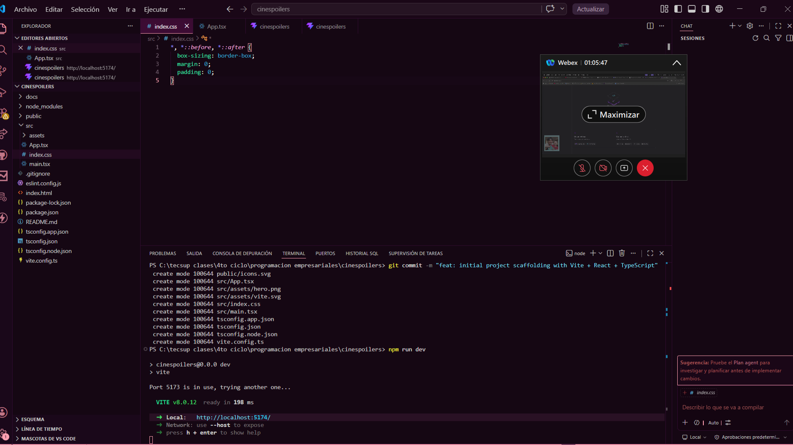
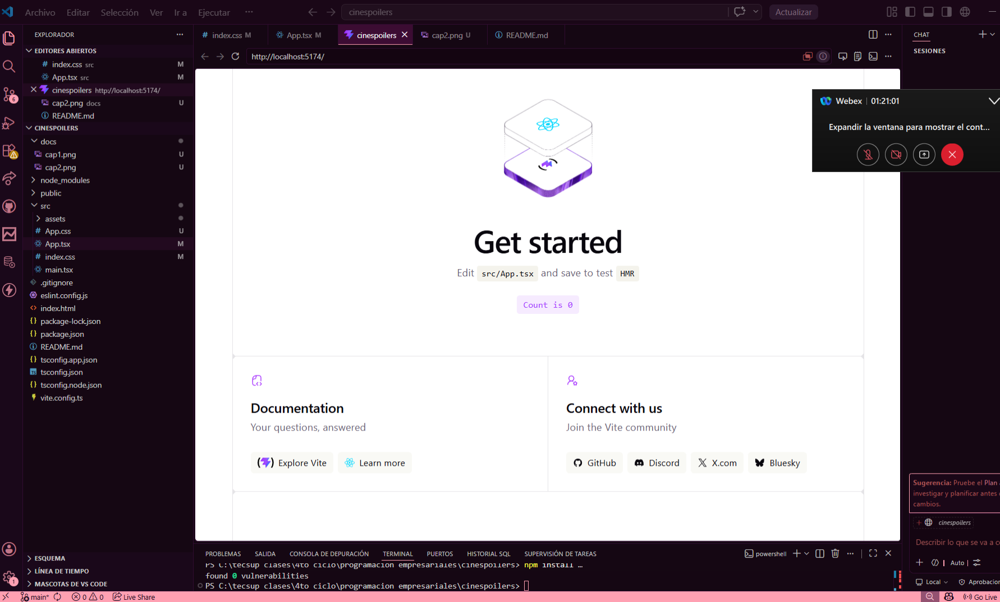
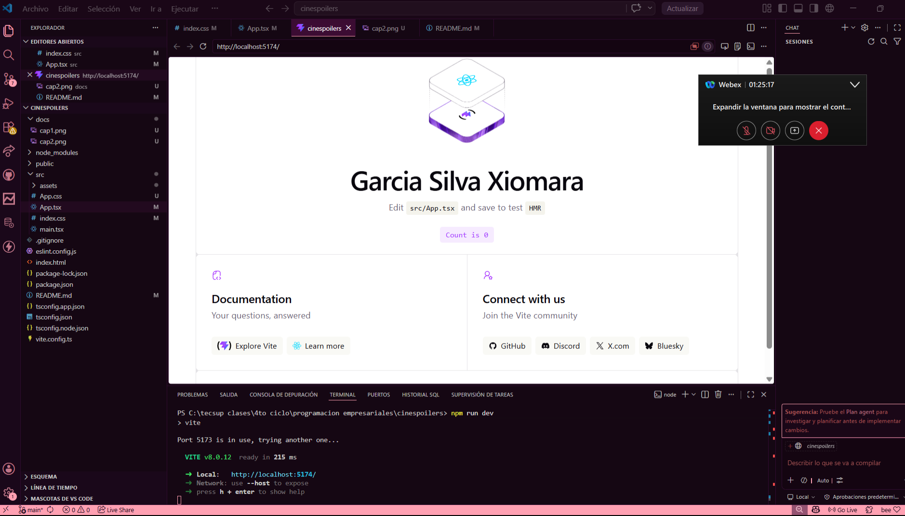
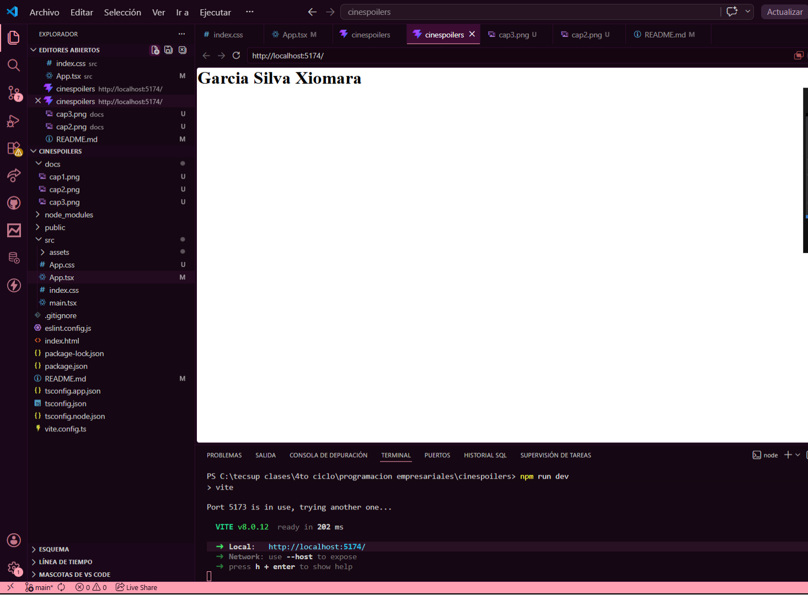
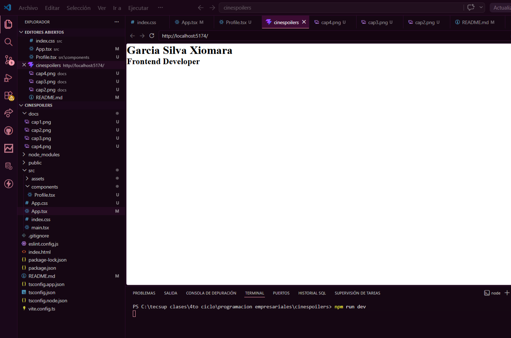

# CineSpoilers 🎬

Proyecto base desarrollado con **React + TypeScript + Vite**.  
Primera aplicación React como parte del aprendizaje de Programación Empresarial — Tecsup.

---

## 📸 Capturas del proceso

### 1. Proyecto creado

### 2. Proyecto corriendo en el navegador

### 3. Reemplazando "Get Started" por nombre propio

### 4. Nombre y apellido en pantalla

### 5. Componente Profile — primeros pasos con componentes React

---

## 👨‍💻 Autor

**Garcia Silva Xiomara** — Tecsup, 4to ciclo · Programación Empresarial